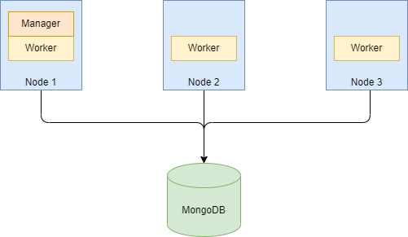

# SysAgent

A common scenario these days is to run a SpringBoot application in a cluster (e.g. on AWS ECS) with MongoDB as the database. 
However, this setup poses a problem if you need to run a batch job. This is when a large number of records need to be
processed automatically within a certain timeframe. One could run the job on one node in the cluster, but then that specific
node needs to be temporarily scaled up in terms of processing capacity. This is tricky to say the least.

SysAgent is a Spring library that turns a cluster of SpringBoot nodes into a simple batch processing setup. It does
this by designating a Manager node, which splits up the work into paritions and each partition is then processed by
one of the nodes in the cluster. Obviously, this only works when the work can be partitioned. But in majority of the
cases this is not a problem. There usually exists some scheme by which records in the batch can be assigned to different
partitions.

SysAgent also  has a built it scheduler for scheduled jobs. The manager node is responsible for executing the job at the
scheduled time. In the event the current manager goes down, the next manager node ensures that the job is triggered.

